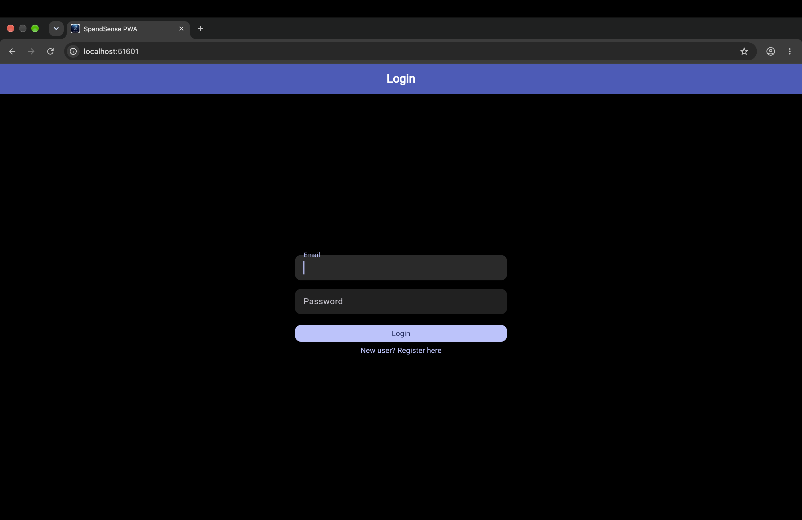
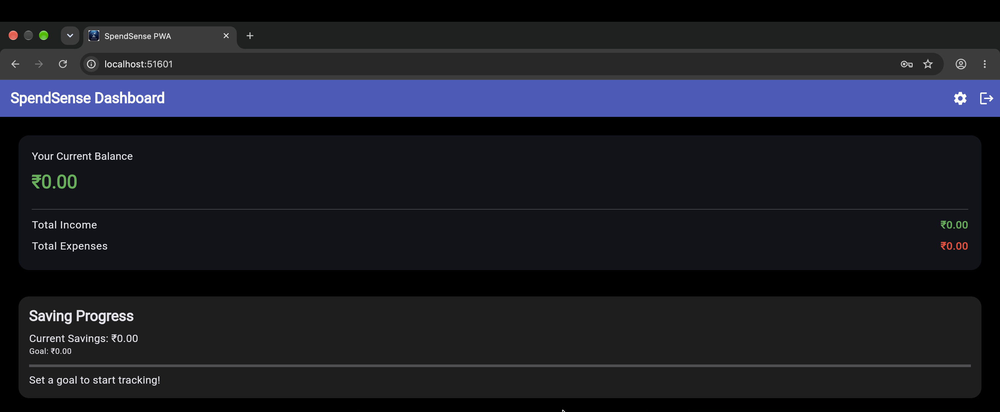
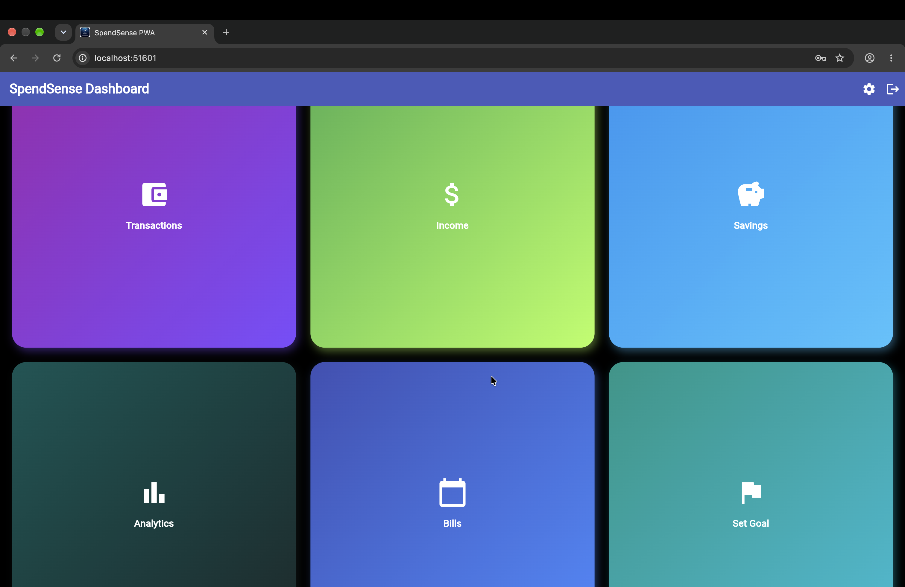
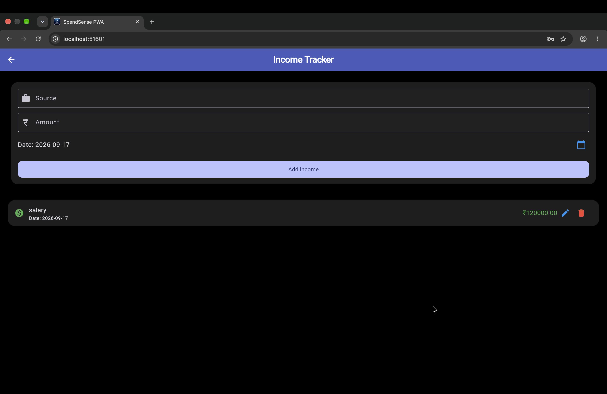
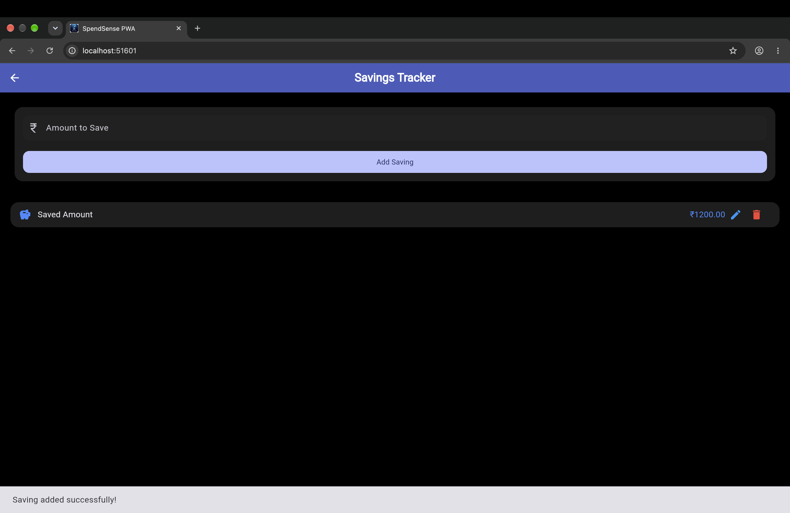
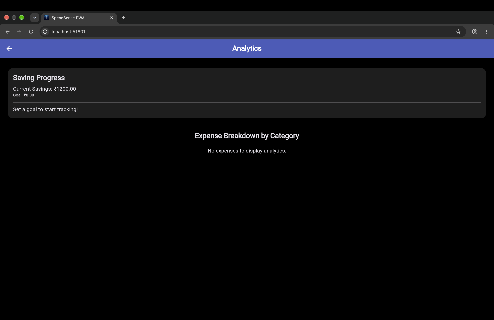
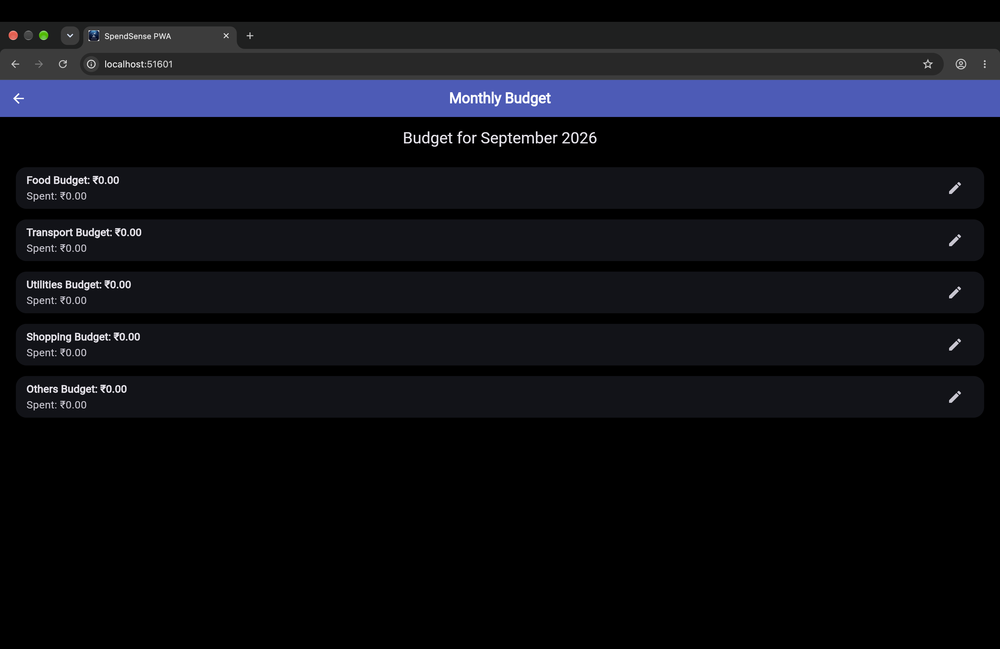
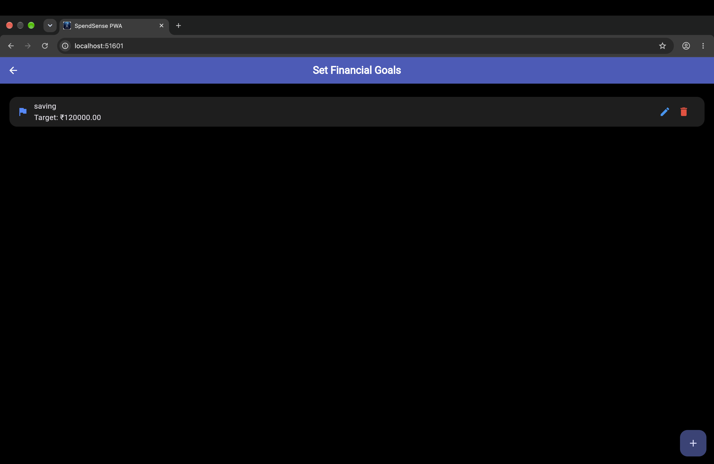
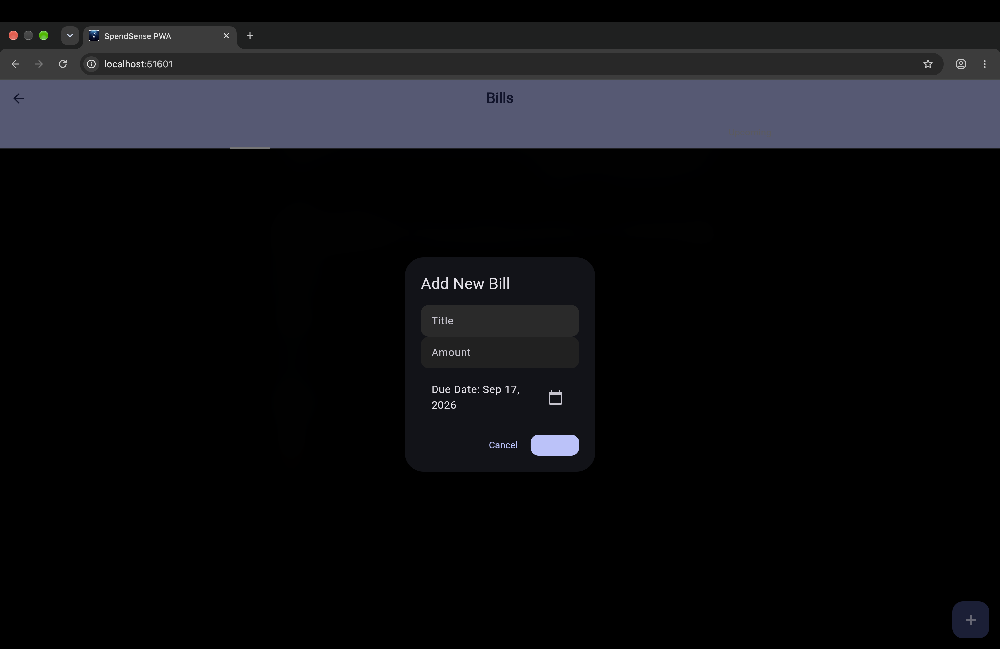
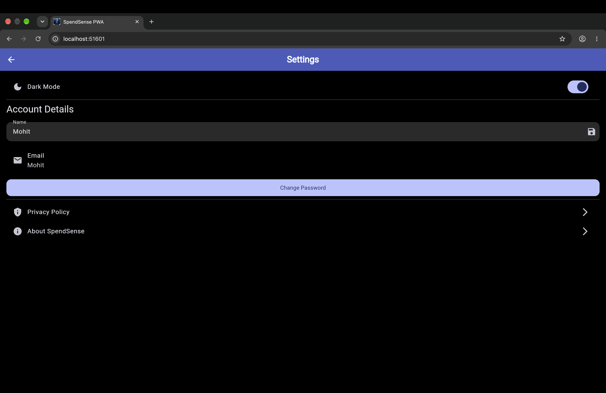

# SpendSense

A personal expense tracker built as a Flutter Progressive Web App — you can install it straight from the browser without an app store, and it works offline.

## Screenshots

<table>
<tr>
<td width="50%"><br/><sub><b>Login</b></sub></td>
<td width="50%"><br/><sub><b>Dashboard — balance overview</b></sub></td>
</tr>
<tr>
<td width="50%"><br/><sub><b>Dashboard — menu grid</b></sub></td>
<td width="50%"><br/><sub><b>Income tracker</b></sub></td>
</tr>
<tr>
<td width="50%"><br/><sub><b>Savings tracker</b></sub></td>
<td width="50%"><br/><sub><b>Analytics</b></sub></td>
</tr>
<tr>
<td width="50%"><br/><sub><b>Monthly budget</b></sub></td>
<td width="50%"><br/><sub><b>Set financial goals</b></sub></td>
</tr>
<tr>
<td width="50%"><br/><sub><b>Bills — add new bill</b></sub></td>
<td width="50%"><br/><sub><b>Settings</b></sub></td>
</tr>
</table>

## What it does

- Log and categorize expenses
- Set budget limits by category and track against them
- Visual spend breakdowns using fl_chart
- Export expense reports as PDF
- Works offline — data is stored locally in the browser, so there's no dependency on a server connection
- Installable as a PWA — add it to your home screen like a native app

## Tech stack

- Flutter, targeting the web as a Progressive Web App
- Provider for state management
- Local browser storage (localStorage) for offline-first data persistence
- fl_chart for the analytics views

## Running it locally

Needs the Flutter SDK. If you don't have it: `brew install --cask flutter` (Mac — see flutter.dev for other platforms).

```bash
flutter pub get
flutter run -d chrome
```

This builds the app and opens it in a new Chrome window on a local port (the exact port varies each run — shown in the terminal and in Chrome's address bar).

Build for production:

```bash
flutter build web
```

Note: this is a local-only PWA — everything is stored in your browser's local storage, not synced to a server, so clearing browser data resets it. You can also "install" it from Chrome's address bar to run it like a native app outside the tab.

## About me

Mohit Raj. [GitHub](https://github.com/mohitrajjj) · [LinkedIn](https://linkedin.com/in/mohit-rajj) · [LeetCode](https://leetcode.com/u/vduZBjuexI/)
